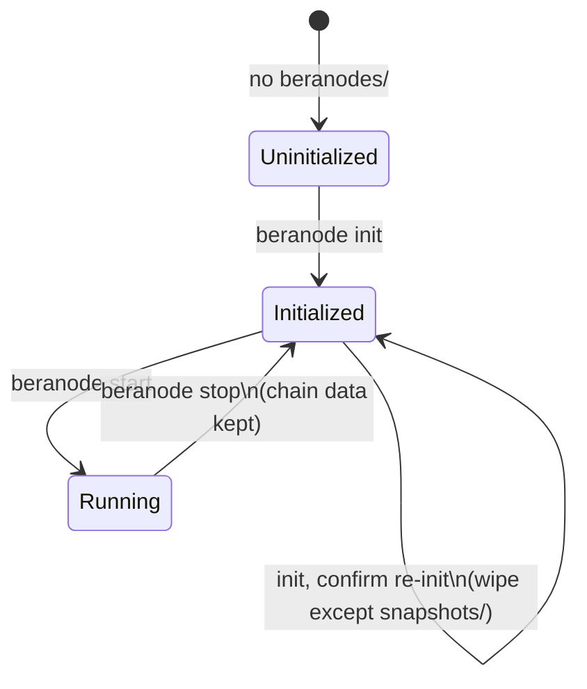
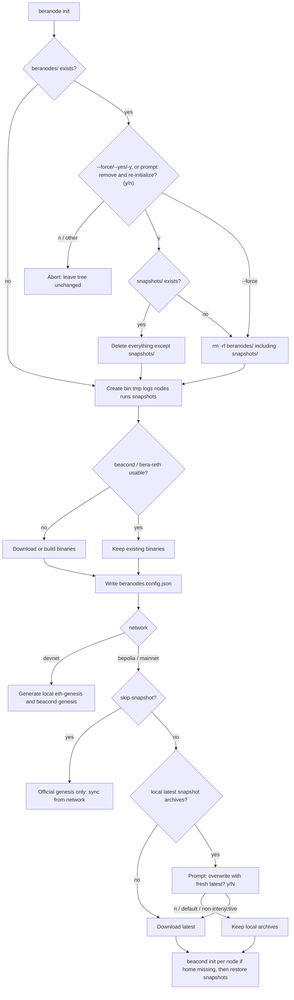
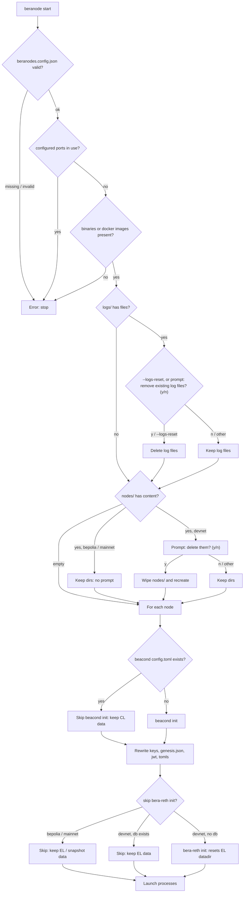

# 🐻🛰️ Beranode CLI

A command-line tool for managing Berachain nodes.

> **⚠️⚠️  EXPERIMENTAL!  ⚠️⚠️**
>
> **This CLI is in an early experimental phase and is actively being worked on.**
>
> **Do _not_ use in production environments. Functionality, configuration, and output formats may change rapidly.**

## Overview

`beranode` is a CLI tool that simplifies the process of setting up and managing Berachain blockchain nodes. It supports multiple networks (`devnet`, `bepolia`, `mainnet`) and can manage validator, full, and pruned nodes.

## Prerequisites

- Bash shell
- Cast CLI version 1.6.0 or higher - https://getfoundry.sh
- `curl`, `wget`, `tar`, `gzip`, `jq`
- `lz4` — required to extract official chain-state snapshots
- Rust (`rustc`) — used when building clients from source
- Required Berachain binaries (downloaded by `init` if missing):
  - `beacond` (BeaconKit consensus client)
  - `bera-reth` (Reth execution client)

Run `beranode deps` to detect the OS/package manager, log installed versions, and optionally install anything missing (Homebrew on macOS; apt, apk, dnf, yum, pacman, or zypper on Linux).

## Installation

1. Clone this repository
2. Make the script executable:
   ```bash
   chmod +x beranode
   ```
3. Install host dependencies (prompts before installing anything missing):
   ```bash
   ./beranode deps
   ```
4. Optionally, add to your PATH or create a symlink

## Usage

### Basic Commands

#### Check / install host dependencies

```bash
./beranode deps
./beranode deps --check
./beranode deps --yes
```

Detects macOS (Homebrew) or Linux (apt, apk, dnf, yum, pacman, zypper), logs the version of each required tool, and asks whether to install anything missing locally. `--check` only reports. `--yes` installs without prompting. Foundry and Rust use Homebrew when `brew` is available; otherwise they install into `~/.foundry` (foundryup) and `~/.cargo` (rustup).

#### Initialize a Node

```bash
./beranode init [options]
```

Initialize a new Berachain node with specified configuration.

**Options:**
- `--moniker <name>` - Set a custom name for your node
- `--network <network>` - Network to connect to: `devnet`, `bepolia`, or `mainnet` (default: `devnet`)
- `--validators|--vals <count>` - Number of validator nodes to create
- `--rpcs <count>` - Number of RPC nodes to create
- `--skip-snapshot` - Skip official snapshot download on bepolia/mainnet (sync from genesis instead)
- `--snapshot-type <pruned|archive>` - Snapshot type for every node (default: `pruned`). `--snapshot-type=archive` fetches archive snapshots
- `--beacond-version <tag>` - BeaconKit release tag (`latest`, `vX.Y.Z`, or `vX.Y.Z-rc.N`)
- `--berareth-version <tag>` - bera-reth release tag (`latest`, `vX.Y.Z`, or `vX.Y.Z-rc.N`)
- `--force`, `--yes`, `-y` - Wipe an existing `beranodes/` directory and re-initialize without prompting, including `snapshots/`. Also overwrites `beranodes.config.json` if it is still present after the wipe
- `--mode <local|docker|serviceman>` - Process runtime (default: `local`)
- `--docker` - Docker mode (alias for `--mode docker`)
- `--serviceman` - Serviceman mode (alias for `--mode serviceman`). macOS launchd or Linux systemd + journald
- `--wallet-private-key <key>` - Private key for the wallet
- `--wallet-address <address>` - Wallet address
- `--wallet-balance <amount>` - Initial wallet balance (default: 1000000000000000000000000000)

Existing `beranodes/` directories, configs, and snapshots are handled by prompts; see [Init and start decision tree](#init-and-start-decision-tree).

**Example:**
```bash
# Initialize a devnet validator node
./beranode init --network devnet --validators 1

# Initialize a Bepolia testnet node (official genesis + snapshots)
./beranode init --network bepolia --validators 1

# Initialize under the host service manager (launchd on macOS, systemd on Linux)
./beranode init --network bepolia --rpcs 1 --mode serviceman

# Initialize multiple nodes with custom moniker
./beranode init --moniker mynode --vals 2 --rpcs 1

# Fetch archive snapshots instead of the default pruned snapshots
./beranode init --network bepolia --rpcs 1 --snapshot-type=archive

# Wipe an existing beranodes/ tree and start fresh (including snapshots/)
./beranode init --network bepolia --rpcs 1 --force
```

#### Start a Node

```bash
./beranode start [options]
```

Start a Berachain node that has been initialized. Network is read from `beranodes.config.json`. In `serviceman` mode this loads launchd jobs (macOS) or systemd user units (Linux) instead of backgrounding PIDs. How existing logs and `nodes/` directories are treated depends on the network; see [Init and start decision tree](#init-and-start-decision-tree).

**Options:**
- `--beranodes-dir <path>` - Beranodes data directory (default: `./beranodes`)
- `--external-ip <ip>` - Public IP advertised to peers (bepolia/mainnet)
- `--bootnodes <enodes>` - Comma-separated EL bootnodes. On bepolia/mainnet, `--bootnodes` is omitted unless this is set (reth's `--chain` preset handles discovery)
- `--trusted-peers <enodes>` - Comma-separated EL trusted peers. On bepolia/mainnet, `--trusted-peers` is omitted unless this is set
- `--ws` - Enable the EL websocket RPC. Without this, `--ws`, `--ws.addr`, `--ws.port`, and `--ws.origins` are omitted
- `--ws.addr <addr>` - Websocket bind address (requires `--ws`; default: `0.0.0.0`)
- `--ws.port <port>` - Websocket port (requires `--ws`; default: `8546` / node `el_ws_port`)
- `--ws.origin <origins>` - Websocket allowed origins (requires `--ws`; default: `*`). Alias: `--ws.origins`
- `--logs-reset` - Remove existing files in `beranodes/logs` without prompting (same as answering `y` to the log-reset prompt)

**Example:**
```bash
./beranode start
```

#### Stop a Node

```bash
./beranode stop [options]
```

Stop nodes from `beranodes.config.json`. Local mode kills PID files; Docker uses compose down; serviceman unloads launchd jobs or systemd user units.

**Example:**
```bash
./beranode stop
```

#### Check Status

```bash
./beranode status [options]
```

Display live node status (snapshot type, EL/CL block height, peers, sync) plus host storage: total volume capacity, space used on the device, and the size of `beranodes/nodes`. The SNAPSHOT column is `pruned` or `archive` for each node (from `snapshot_type` in `beranodes.config.json`, or the role mapping on older configs). Also reports host memory for each running `beacond` / `bera-reth` binary as used/total RAM (for example `val-0-bera-reth: 4.4gb/68gb (6.47%)`). On macOS, total RAM comes from `sysctl hw.memsize` and process RSS from `ps`; on Linux, total RAM is `MemTotal` in `/proc/meminfo` and RSS is `/proc/<pid>/statm`. Docker mode uses `docker stats` on both platforms.

**Options:**
- `--verbose|-v` - One row per service (`beacond`, `bera-reth`)
- `--watch|-w` - Live-refresh mode
- `--interval|-i <seconds>` - Watch refresh interval (default: `2`)
- `--json` - Machine-readable JSON (incompatible with `--watch`)
- `--beranodes-dir <path>` - Beranodes data directory (default: `./beranodes`)

**Example:**
```bash
./beranode status
./beranode status --watch
./beranode status --json
```

#### Snapshots (bepolia / mainnet)

```bash
./beranode snapshot [download|restore] [options]
```

Download and restore official chain-state snapshots from [bepolia.snapshots.berachain.com](https://bepolia.snapshots.berachain.com) or [snapshots.berachain.com](https://snapshots.berachain.com).

`init --network bepolia` (or `mainnet`) does this automatically. Use `beranode snapshot` to refresh later. Nodes must be stopped before `restore`.

**Defaults:** every node gets **pruned** snapshots. Pass `--snapshot-type=archive` (or `--snapshot-type archive`) to fetch **archive** snapshots for every node.

Pruned Bepolia execution snapshots are ~10.5 GB; archive execution is ~42 GB. Mainnet archive execution is ~1 TB. The CLI prints types, sizes, and destination nodes, then continues. If `{network}-beacond-{type}-latest.tar.lz4` and `{network}-reth-{type}-latest.tar.lz4` are already in `beranodes/snapshots/`, you are prompted first: overwrite with a fresh network download (`y`) or keep the local files (`N`, default). Keeping them skips the download. Re-running `init` on an existing `beranodes` directory preserves `beranodes/snapshots/` so previously downloaded archives are not deleted. `init --force` deletes `snapshots/` as well.

Validator keys are generated on public networks, but the node is **not** in the public validator set until you deposit separately. This CLI does not automate that deposit.

#### Validate Configuration

```bash
./beranode validate [config_path]
```

Validate the `beranodes.config.json` file to ensure all fields are correctly formatted using regex patterns.

**Arguments:**
- `config_path` - Path to beranodes.config.json (optional, defaults to `./beranodes/beranodes.config.json`)

**What it validates:**
- String formats (monikers, network names, paths)
- Boolean values (true/false)
- Integer numbers and port ranges (1-65535)
- Ethereum addresses (0x + 40 hex chars)
- Private keys and JWT tokens (0x + 64 hex chars)
- BLS public keys (0x + 96 hex chars)
- URLs and time durations (e.g., 5m0s, 10s)
- Node and deposit object structures

**Example:**
```bash
# Validate default config
./beranode validate

# Validate specific config file
./beranode validate ./custom/path/beranodes.config.json
```

**Example output:**
```
[INFO] Starting validation of beranodes configuration
[INFO] Config file: ./beranodes/beranodes.config.json

Validating beranodes configuration: ./beranodes/beranodes.config.json
✓ All validations passed successfully

[OK] Configuration validation completed successfully!
```

For detailed documentation on validation functions and programmatic usage, see [docs/VALIDATION.md](docs/VALIDATION.md).

#### Show Help

```bash
./beranode --help
./beranode -h
./beranode help
```

Display help information about available commands.

#### Show Version

```bash
./beranode --version
./beranode -v
./beranode version
```

Display the current version of the beranode CLI.

#### Interactive Menu

```bash
./beranode
```

Running `beranode` without any arguments will launch an interactive menu to guide you through the available options.

## Network Configuration

### Supported Networks

- **Devnet**: Chain ID 80087 (name: `devnet`)
- **Testnet**: Chain ID 80069 (name: `bepolia`)
- **Mainnet**: Chain ID 80094 (name: `mainnet`)

### Default Ports

- Consensus Layer (CL) RPC: 26657
- Consensus Layer (CL) P2P: 26656
- Consensus Layer (CL) Proxy: 26658
- Execution Layer (EL) RPC: 8545
- Execution Layer (EL) Auth RPC: 8551
- Execution Layer (EL) P2P: 30303
- Execution Layer (EL) Prometheus: 9101
- Consensus Layer (CL) Prometheus: 9102

## Directory Structure

The beranode CLI creates the following directory structure:

```
beranodes/
├── bin/          # Binary files (beacond, bera-reth)
├── tmp/          # Temporary files
├── logs/         # Log files (e.g., silent-smile-forest-0-val-beacond.log)
├── runs/         # PID files for running nodes (local mode)
├── services/     # launchd plists + launchd.json, or systemd units + systemd.json
├── snapshots/    # Official chain-state archives
│   ├── bepolia/  # bepolia .tar.lz4 plus unzipped beacond/ and reth/
│   └── mainnet/  # mainnet .tar.lz4 plus unzipped beacond/ and reth/
└── nodes/        # Node configurations
    ├── 0-validator       # Validator node 0
    ├── 1-validator       # Validator node 1
    ├── 2-rpc             # RPC node 2
    └── 3-rpc             # RPC node 3
```

## Init and start decision tree

`init` writes `beranodes/` (config, binaries, genesis or snapshots). `start` reads that config, prepares each node home, and launches `beacond` + `bera-reth`. Disk state — not the flags alone — decides what each command does.

### Lifecycle



| State | On disk | Typical next command |
| --- | --- | --- |
| Uninitialized | No `beranodes/` (or you declined re-init) | `init` |
| Initialized | `beranodes.config.json` plus binaries; node homes and snapshots may already exist | `start`, or `init` to wipe and recreate |
| Running | Same as initialized, plus live PIDs / launchd or systemd jobs / compose | `status`, `stop` |

### `beranode init`



Re-init always unloads leftover launchd or systemd jobs for that directory before wiping. Answering `y` to the prompt preserves `snapshots/` if it exists. `--force` / `--yes` / `-y` skips the prompt and deletes the whole tree, including `snapshots/`.

If `beranodes.config.json` is still present after directory setup, init asks whether to overwrite it. `n` keeps that file and **skips** genesis, keys, node homes, and snapshot restore. `--force` overwrites that file without asking.

On bepolia/mainnet, `beacond init` is skipped when `nodes/<i>-<role>/beacond/config/config.toml` already exists so snapshot data is not wiped. `--skip-snapshot` skips the download/restore and the node syncs from the public network instead.

### `beranode start`



Start always rewrites consensus keys (`priv_validator_key.json`, `node_key.json`), `genesis.json`, `jwt.hex`, toml configs, and the bera-reth `discovery-secret` from `beranodes.config.json`, even when node directories are kept. Chain databases are the exception: CL data is kept when `config.toml` already exists; EL data is kept on public networks because `bera-reth init` is not run, and on devnet when `bera-reth/db` already exists.

On **devnet**, answering `n` to the node-directory prompt keeps existing homes and continues start (same as the log prompt). Public networks keep dirs with no prompt.

### Prompt summary

| Command | When | Prompt | `y` | `n` |
| --- | --- | --- | --- | --- |
| `init` | `beranodes/` exists | Remove and re-initialize? | Wipe tree (`snapshots/` kept if present), then init | Abort, no changes |
| `init` | `beranodes.config.json` still present | Overwrite it? | Rewrite config and continue genesis/snapshots | Keep config; skip genesis, homes, snapshots |
| `init` | Public network, local latest snapshot archives | Overwrite with a fresh latest snapshot? `[y/N]` | Download again | Keep local files (default; also the non-interactive choice) |
| `init` | Devnet, `tmp/genesis.json` exists | Overwrite the existing genesis file? | Regenerate genesis | Skip genesis generation |
| `start` | `beranodes/logs/` has files | Remove existing log files? | Delete logs | Keep logs, continue |
| `start` | `beranodes/nodes/` has content, **devnet** | Delete them? | Wipe and recreate homes | Keep dirs, continue |
| `start` | `beranodes/nodes/` has content, **bepolia/mainnet** | _(none)_ | — | Dirs kept automatically |

`init --force` (`--yes` / `-y`) wipes the whole `beranodes/` tree including `snapshots/` (and leftover config overwrite) without asking. `start --logs-reset` answers `y` to the log prompt without asking.

## Examples

### Quick Start - Devnet Validator

```bash
# Initialize a single validator node on devnet
./beranode init --network devnet --validators 1

# Start the node
./beranode start
```

### Serviceman mode (macOS launchd / Linux systemd)

`serviceman` is local-mode binaries supervised by the host service manager. Init still downloads native `beacond` / `bera-reth`; the difference is start/stop/logs.

```bash
./beranode init --network bepolia --rpcs 1 --serviceman
./beranode start
./beranode stop
```

- macOS: requires `launchctl`. Jobs are user LaunchAgents (`~/Library/LaunchAgents/com.berachain.beranode.<hash>.<moniker>.<index>.<component>.plist`), not system daemons (no root). `KeepAlive` restarts a crashed process. `beranode stop` unloads the jobs and removes those LaunchAgents so they do not come back at login. Plist copies remain in `beranodes/services/` for inspection. Stdout and stderr go to `beranodes/logs/`.
- Linux: requires systemd (`systemctl`, `/run/systemd/system`) and journald (`journalctl`, journal socket), plus a working `systemctl --user` session. Units are user services (`~/.config/systemd/user/com.berachain.beranode.<hash>.<moniker>.<index>.<component>.service`), not system daemons (no root). `Restart=always` with a 10s delay matches launchd KeepAlive. Logs go to journald (`journalctl --user -u <unit> -f`) and are mirrored to `beranodes/logs/`. Unit copies and `systemd.json` live in `beranodes/services/`. `beranode stop` disables and removes those user units. If lingering is off, units may stop on logout; enable with `sudo loginctl enable-linger $USER`.
- Init fails instead of falling back to local when the platform service manager is missing.
- Do not combine `--docker` and `--serviceman`.

### Multi-Node Setup

```bash
# Initialize a network with validators and RPC nodes
./beranode init \
  --moniker mynetwork \
  --network devnet \
  --vals 2 \
  --rpcs 1
```

### Custom Wallet Configuration

```bash
# Initialize with custom wallet settings
./beranode init \
  --network devnet \
  --validators 1 \
  --wallet-address 0x1234... \
  --wallet-private-key 0xabcd... \
  --wallet-balance 5000000000000000000000000000
```

## Testing Your Node

Once your node is running, you can test the RPC endpoints using the following curl commands:

### Test Execution Layer RPC (JSON-RPC)

Check the current block number on the execution layer:

```bash
curl -s --location 'http://localhost:8545' \
--header 'Content-Type: application/json' \
--data '{
  "jsonrpc": "2.0",
  "method": "eth_blockNumber",
  "params": [],
  "id": 420
}' | jq;
```
### Test Execution Layer RPC For Peers

```bash
curl -s -X POST -H "Content-Type: application/json" \
  --data '{"jsonrpc":"2.0","method":"net_peerCount","params":[],"id":1}' \
  http://localhost:8545
```

### Test Consensus Layer RPC (CometBFT)

Check the number of connected peers on the consensus layer:

```bash
curl -s --location 'http://localhost:26657/net_info' | jq .result.n_peers;
```

### Test Beacon Node API

Check the latest slot on the beacon node:

```bash
curl -s --location 'http://localhost:3500/eth/v2/debug/beacon/states/head' | jq .data.latest_block_header.slot;

# [Expected]:
# null
# ...
# "0x3"
# "0x4"
```

## Troubleshooting

### Check Cast Version

Ensure you have the correct version of Cast installed:
```bash
cast --version
```

Required version: 1.4.3 or higher

### Verify Binaries

Make sure the required binaries are available:
```bash
which beacond
which bera-reth
```

## Testing

The [tests/](tests/) directory contains a comprehensive test suite for validating the beranode CLI functionality.

### Test Framework

The test suite uses a custom lightweight bash testing framework ([tests/test_framework.sh](tests/test_framework.sh)) that provides:

- **Assertion Functions**: `assert_equals`, `assert_success`, `assert_failure`, `assert_contains`, `assert_not_contains`, `assert_file_exists`, `assert_dir_exists`, `assert_empty`, `assert_not_empty`
- **Test Organization**: Group tests into suites with `test_suite "Suite Name"`
- **Result Reporting**: Colored output with pass/fail statistics
- **Test Management**: Skip tests when needed with `skip_test`

### Available Tests

- **[test_validation.sh](tests/test_validation.sh)** - Tests for validation functions including:
  - Port validation (valid ranges, edge cases)
  - Network name validation
  - Boolean validation (true/false)
  - Integer validation
  - Ethereum address validation (0x + 40 hex chars)
  - Private key validation (0x + 64 hex chars)
  - URL validation (http, https, tcp, ws, wss)
  - Moniker validation (length and format)
  - Duration validation (s, m, h, ms, us, ns)
- **[test_download.sh](tests/test_download.sh)** - Tests for GitHub release asset URL matching
- **[test_snapshots.sh](tests/test_snapshots.sh)** - Tests for public-network URL mapping, role→snapshot type, and index.csv selection
- **[test_deps.sh](tests/test_deps.sh)** - Tests for OS/package-manager detection, version parsing, and dry-run installs
- **[test_serviceman.sh](tests/test_serviceman.sh)** - Tests for launchd plist generation, systemd unit/journald quoting, and platform gates
- **[test_init.sh](tests/test_init.sh)** - Tests for `init --force` / `--yes` / `-y` wiping an existing `beranodes/` tree including `snapshots/`

### Running Tests

Execute tests from the tests directory:

```bash
cd tests
./test_validation.sh
./test_download.sh
./test_snapshots.sh
./test_deps.sh
./test_serviceman.sh
./test_init.sh
```

Or run from the project root:

```bash
bash tests/test_validation.sh
bash tests/test_download.sh
bash tests/test_snapshots.sh
bash tests/test_deps.sh
bash tests/test_serviceman.sh
bash tests/test_init.sh
```

### Test Output Example

```
=== Test Suite: Port Validation ===
  ✓ Port 1 is valid
  ✓ Port 8545 is valid
  ✓ Port 65535 is valid (max)
  ✓ Port 0 is invalid
  ✓ Port 65536 is invalid (over max)

========================================
Test Results
========================================
Total:  45
Passed: 45
Failed: 0
========================================
✓ All tests passed!
```

### Writing New Tests

To add new tests, create a new test file or extend existing ones:

1. Source the test framework: `source test_framework.sh`
2. Source any modules you need to test
3. Organize tests with `test_suite "Your Suite Name"`
4. Use assertion functions to validate behavior
5. Call `print_results` at the end

Example test structure:

```bash
#!/usr/bin/env bash
source test_framework.sh
source ../src/lib/your_module.sh

test_suite "Feature Tests"
assert_success 'your_function "valid input"' "Should handle valid input"
assert_failure 'your_function "invalid input"' "Should reject invalid input"

print_results
```

## Changelog

User-facing changes are recorded in [CHANGELOG.md](CHANGELOG.md) using [Keep a Changelog](https://keepachangelog.com/en/1.0.0/). Write new work under `[Unreleased]` in the matching category:

- **Added** — new features
- **Changed** — changes in existing behavior
- **Deprecated** — soon-to-be-removed features
- **Removed** — removed features
- **Fixed** — bug fixes
- **Security** — vulnerability fixes

Do not edit historical `## [X.Y.Z]` sections. When releasing, promote `[Unreleased]` by hand:

1. Move the `[Unreleased]` entries into a dated `## [X.Y.Z] - YYYY-MM-DD` section
2. Leave a fresh empty `[Unreleased]` template (with the six category headings) above it
3. Optionally add **Summary** and **Changed Files**
4. Update the compare links at the bottom (`[Unreleased]: …compare/vX.Y.Z...HEAD` and `[X.Y.Z]: …compare/vPREV...vX.Y.Z`)

[.github/workflows/release.yml](.github/workflows/release.yml) copies that version section into the GitHub Release body.

## Versioning

This project follows [Semantic Versioning](https://semver.org/) (SemVer). The current CLI version is **0.12.0**. The single source of truth is `BERANODE_VERSION` in [src/lib/constants.sh](src/lib/constants.sh). `build.sh` reads that value when it generates the `beranode` binary. `beranode version` / `--version` / `-v` print `beranode v${BERANODE_VERSION}`.

Version numbers use `MAJOR.MINOR.PATCH`, with optional prereleases:

- **MAJOR**: Incompatible API changes
- **MINOR**: New functionality in a backwards-compatible manner
- **PATCH**: Backwards-compatible bug fixes
- **Prerelease**: `X.Y.Z-rc.N`, `X.Y.Z-alpha.N`, `X.Y.Z-beta.N`, or `X.Y.Z-pre.N`

Do not rewrite every `vX.Y.Z` string in the tree. Runtime version output always comes from `BERANODE_VERSION`.

### Client versions (beacond / bera-reth)

`init` downloads client binaries when they are missing. On `bepolia` and `mainnet`, `latest` (the default) is replaced with the recommended tags in [src/lib/constants.sh](src/lib/constants.sh) / [src/lib/network.sh](src/lib/network.sh):

| Network | beacond | bera-reth |
| --- | --- | --- |
| bepolia | `v1.4.1` | `v1.4.4` |
| mainnet | `v1.4.1` | `v1.4.4` |
| devnet | GitHub `latest` | GitHub `latest` |

Override with `--beacond-version` / `--berareth-version`. Accepted tags: `latest`, `vX.Y.Z`, `vX.Y.Z-rc.N`, or `vX.Y.Z-rcN`.

### Releasing

1. Set `BERANODE_VERSION` in [src/lib/constants.sh](src/lib/constants.sh) (and the VERSION header in [src/core/dispatcher.sh](src/core/dispatcher.sh) if it is present)
2. Promote `[Unreleased]` in [CHANGELOG.md](CHANGELOG.md) as described above
3. Rebuild the binary: `./build.sh`
4. Commit those files and create an annotated tag matching the version:

```bash
git tag -a v0.10.0 -m "Release v0.10.0"
git push origin HEAD
git push origin v0.10.0
```

Pushing a `vX.Y.Z` or `vX.Y.Z-*` tag triggers [.github/workflows/release.yml](.github/workflows/release.yml). The workflow reads the matching changelog section, marks prerelease tags as prereleases, and creates a [GitHub Release](https://github.com/berachain/beranode-cli/releases) with the `beranode` binary attached (or uploads `beranode` onto an existing release).

## Contributing

Contributions are welcome! Please feel free to submit issues or pull requests.

When contributing:
1. Document your changes in [CHANGELOG.md](CHANGELOG.md) under `[Unreleased]` (see [Changelog](#changelog))
2. Follow the existing code style and conventions
3. Test your changes thoroughly before submitting

### Code Formatting

All shell scripts should be formatted using [shfmt](https://github.com/mvdan/sh):

**Installation:**
```bash
brew install shfmt
```

**Format all shell scripts:**
```bash
shfmt -w .
```

**Check formatting before committing:**
```bash
shfmt -d .
```

## License

See LICENSE file for details.
